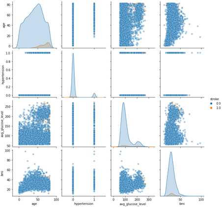
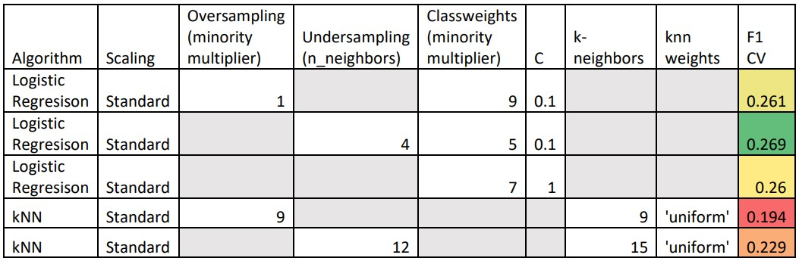

# Classification MVP
## Stroke Prediction
##### Josh Wang
##### Apr 10 2022

---
### MVP Overview
**Goal**:
Predicting the onset of stroke based on a patient's physical characteristics.

**Process**:
•	The dataset was downloaded from here: https://www.kaggle.com/fedesoriano/stroke-prediction-dataset
•	Categorical variables were one-hot encoded.
•	Missing values were filled in by kNNimputing.
•	I have tried using undersampling, oversampling, and class weights to deal with class imbalance of the dataset.
•	Logistic Regression and kNN were used to predict the result.

**Preliminary Results**:

Figure 1. Pairplot of a few numerical variables from the dataset. The output variable classes are highly imbalanced.

Table 1. Output of 5 GridSearchCV runs. Due to class imbalance, the F1 score was chosen as the evaluation metric. Undersampling + Cass Weights + Regularization + Logistic Regression is the winner. The winner predicts the Test Data with F1: 0.319, Accuracy: 0.858, Precision: 0.209, Recall: 0.68.

**Next Steps**:

Try other algorithms. Work on the Flask app.